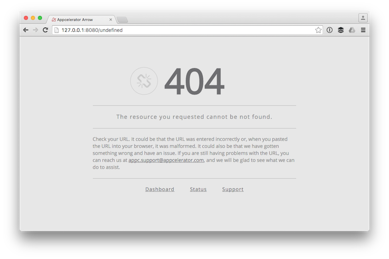
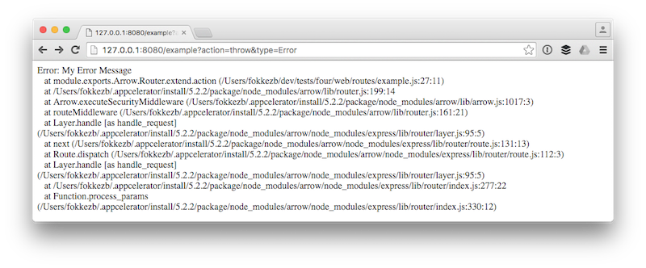
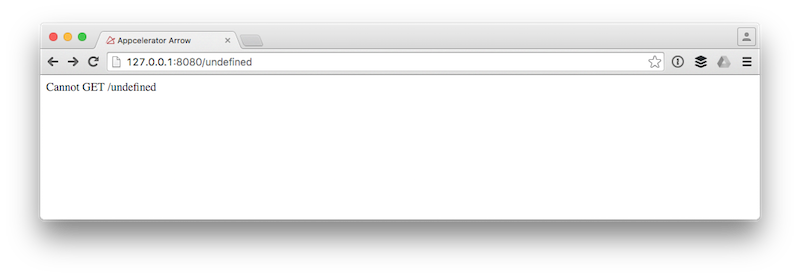
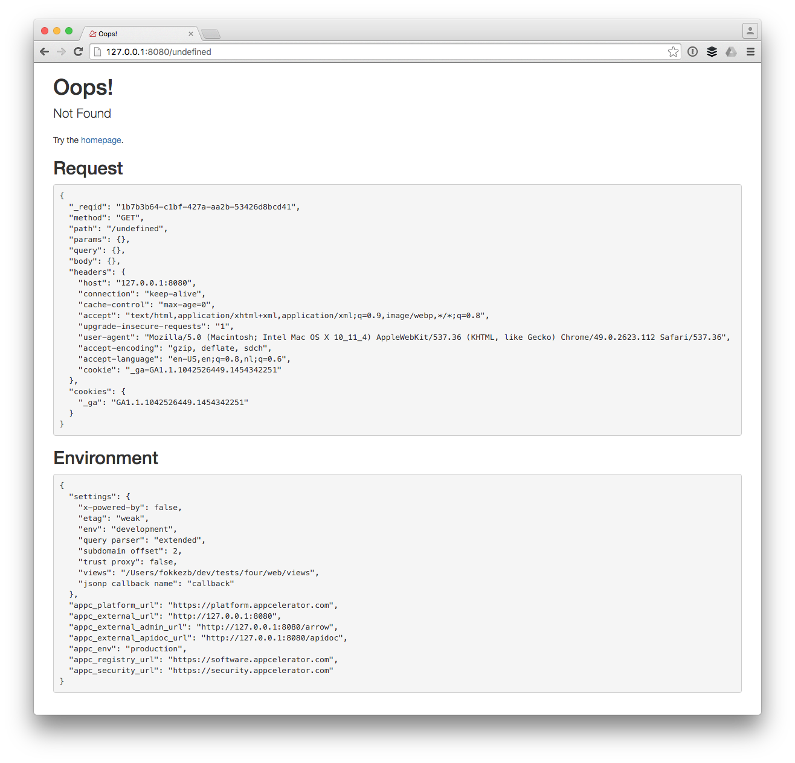
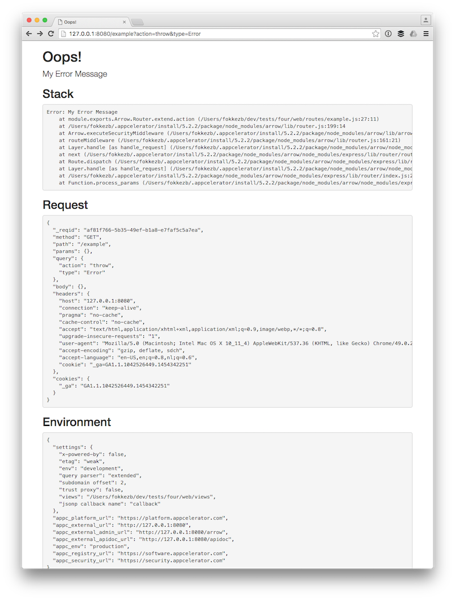
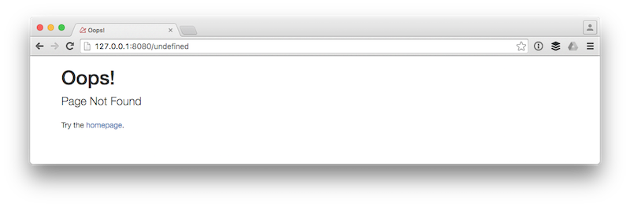

# Custom Error Pages for Arrow Web

[Arrow Web](http://docs.appcelerator.com/platform/latest/#!/guide/Arrow_Web) is part of the Arrow family and the successor of [Node.ACS](http://docs.appcelerator.com/platform/latest/#!/guide/Migrating_Node.ACS_Applications_to_Arrow). It allows you to add additional public routes to an [Arrow Builder Application](http://docs.appcelerator.com/platform/latest/#!/guide/Arrow_Builder) to serve as front-ends to pretty much anything from a custom CMS to manage ArrowDB data or websites consuming Arrow APIs like we've done for the [University](http://university.appcelerator.com/), [Developer Portal](http://developer.appcelerator.com/) and many other of our properties.

Arrow uses the popular [Express](http://expressjs.com/en/4x/api.html).

## Default Error Pages

By default, your Arrow Web routes will use the 404 template of the Arrow Admin:



And if your route throws or calls `next()` with an Error your users will see:



## Disable Default 404

Since Arrow 1.7.10 (part of Appcelerator CLI 5.0.2) you can disable the default 404 page in by setting `admin.disableDefault404:false` in one of your [configuration files](conf/default.js#L62).

With this disabled your 404's will now look like:



Different? Yes. What you want? Probably not. So let's customise that..

## Add our Middleware

In our [app.js](app.js#L14) we require add two middleware, after Arrow has `started` and initialised all routes. To keep our code clean we export these middleware from a new [lib/middleware.js](lib/middleware.js).

## Custom 404 Middleware

In our [pageNotFound](lib/middleware.js#L6) middleware we check for `res.bodyFlushed`. In Arrow we don't send the response to the client right away so that you can use [Arrow Blocks](http://docs.appcelerator.com/platform/latest/#!/guide/Arrow_Blocks) to modify the response. For Arrow Web routes calling `res.render()` will send the response. In both cases this flag will be set once a response has been sent. Since our `pageNotFound` is the second last middleware we can assume no route matched the request if this property has not been set yet. **tl;dr** it's a four-o-four.

Instead of rendering a 404 template here, we call `next()` which accepts an error (of any type) as its argument. Which brings us to..

## Custom Error Middleware

Whenever routing or middleware functions call `next()` with an error, all remaining middleware will be skipped until it finds middleware that accepts four instead of three arguments, so-called [error-handling middleware functions](http://expressjs.com/en/guide/error-handling.html).

Like our [errorHandler](lib/middleware.js#L22) middleware.

You can pretty much do whatever you want in custom error handler or handlers. Log the error, notify devops and of course display a friendly message to the user.

As you explore [our example](lib/middleware.js#L22) there's a few things to pay attention to:

* This handler accepts [strings](lib/middleware.js#L24) and [plain objects](lib/middleware.js#L41) so that you can throw or call `next()` with a string or plain object with a message, status and/or code. Be aware that this won't get you a stack trace. We'll get back to a better solution for that.
* The handler again [checks `res.bodyFlushed`](lib/middleware.js#L44). It will always log the error, but once a response has been sent we cannot communicate with the client anymore.
* The handler [checks `req.xhr`](lib/middleware.js#L52) and returns JSON in case the client used `XMLHttpRequest`, e.g. via jQuery.
* When the [request does not accept HTML](lib/middleware.js#L61) we pass the error on to the builtin error handler. The client is probably calling an Arrow Builder API.
* If we're in a development environment, the handler will [collect additional details](lib/middleware.js#L66) to help the developer debug the error.
* Finally, we pass everything we know [on to the renderer](lib/middleware.js#L72). Notice this works slightly different from how you'd normally work in Arrow or Express routes because of how Arrow buffers the response as we discussed before. We don't call `res.render()` but `req.server.app.render()` and then send the rendered template to the client. Make sure you handle the edge case where the template itself might produce an error.

## Testing our Custom Error Pages

To test a 404, simply go to `/undefined` or any other URL that does not exist:



To test throwing or calling `next()` with errors, I've wired up the [/example](web/routes/example.js) route with 2 parameters you can set via the query string:

* `action` can be `throw`, `next` and will default to `render`. The values pretty much speak for themselves.
* `type` is what would be thrown or passed on to `next()`. This can be `Error`, `Object` or (the default) `String`, but also `HttpError`.

For example if we call `/example?action=throw&type=Error` you will get:



As you can see in the [error template](web/views/error.ejs) the stack trace, request and environment information will not be visible in production:



## Using Custom Error Types

I'm a lazy developer so instead of:

```js
var e = new Error('Unauthorized');
e.status = 401;
return next(e);
```

I rather do:

```js
return next({status:401, message: 'Unauthorized'});
```

But as we discussed this won't get us a Stack Trace. The proper way to deal with this are [Custom Error Types](https://developer.mozilla.org/en-US/docs/Web/JavaScript/Reference/Global_Objects/Error#Custom_Error_Types) that  extend [Error](https://developer.mozilla.org/en-US/docs/Web/JavaScript/Reference/Global_Objects/Error).

This is what the [/example](web/routes/example.js#L28) uses when you call it with `type=HttpError`. You can find this custom error type in [lib/HttpError.js](lib/HttpError.js). As you can see I follow [Mozilla's guide](https://developer.mozilla.org/en-US/docs/Web/JavaScript/Reference/Global_Objects/Error#Custom_Error_Types) and override the constructor to accept an [Http Status Code](https://www.w3.org/Protocols/rfc2616/rfc2616-sec10.html) as well as an optional error code.

There's two things I do different from Mozilla. Like their guide we [generate the stack trace](lib/HttpError.js#L10) by creating a `new Error()` within the constructor. But by passing the message to it we make sure that gets includes in the first line of the stack as well. Because we generate the stack within the constructor the first line (last step) of the trace will always lead to the constructor. I find this confusing so I use a simple [RegExp](https://developer.mozilla.org/en-US/docs/Web/JavaScript/Reference/Global_Objects/Regexp) to remove that line.

Let's build some fancy Arrow apps with just-as-fancy error pages!

Code Strong! 🚀